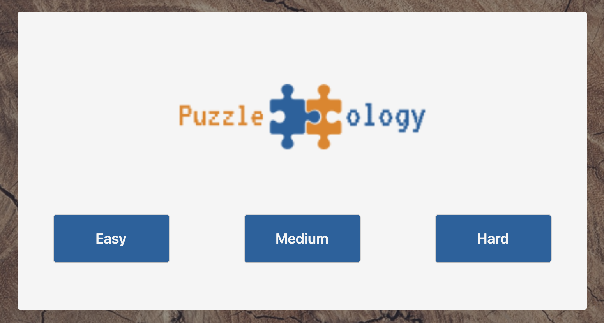

# Puzzleology

### Drag and drop jigsaw puzzle game. The game is created entirely with Javascript DOM manipulation and Canvas. Fluid design and easy intuitive navigation. Lets user select difficulty, upload their own image for a custom puzzle, and you can even pause the music.

### Link: https://jasimatiyeh.github.io/Puzzelology/



### Technologies:
  1. JavaScript
  2. CanvasJS
  3. HTML
  4. CSS

## Key Features & Implementation
  ### Canvas
  #### Feature
  CanvasJS is used entirely for displaying the puzzle. A difficulty is selected, which decides how many pieces are on the board, and then an image is picked from the selection or uploaded. Then the image, made into several pieces, are drawn on the canvas.

  

  #### Implementation
  Using CanvasJS is a very manual process. Each click that a user makes must track where the mouse click event happens, iterates through an array containing references to where each piece on the board is at, and finds the piece selected. The canvas must be redrawn after each mouse click with the updated location of all the pieces.

  ```javascript
    const checkPieceClicked = () => {
      let piece;

      for (let i = 0; i < pieces.length; i++) {
        piece = pieces[i];
        if ((mouse.x < piece.xPos) || (mouse.x > (piece.xPos + pieceWidth)) || (mouse.y < piece.yPos) || (mouse.y > (piece.yPos + pieceHeight))) {
          continue;
        } else {
          return piece;
        }
      }
      return null;
    };
  ```
  
  ### DOM Manipulation
  #### Feature
  Since the canvas only handles the puzzle for the game, all other interactions use JavaScript DOM manipulation. The difficulty selection, image selection, and in game menu are handled using DOM manipulation.

  

  #### Implementation
  Moving from one screen to the other, or showing the in game menu require querying the page for the specific elements and changing the class to have the 'hidden' class with a display none attribute. This frees me from having to make labours clickable areas in canvas, and keeps this to a single page web app.

  ```javascript
    export const banner = (titleBanner, imageSelector, puzzle) => {
      let difficultyButtons = document.querySelectorAll('.difficulty-buttons');
      difficultyButtons.forEach(button => button.addEventListener('click', () => (
        setDifficulty(button.textContent, titleBanner, imageSelector, puzzle)
      )));
    };
  ```

## Future Concepts
  #### Time clock
  Have a time clock that will initialize when the puzzle is first drawn. This will require utilizing setTimeout to increment a display of numbers every 1000ms. This will give the player a chance to see how good fast then can sole the puzzle.
  #### High score
  With a time clock implemented, it will be easy to track each of the players time for each puzzle solve. The players time can be tracked in the local storage, and displayed next to the active canvas. Now the player can so how good they really are.
  #### Puzzle piece shapes
  This will give the quintessential puzzle piece to the game. This will require a bit more work with the canvas to draw the actual individual shapes, makes sure that the edges are flat, and that the shapes are somewhat unique. With more work and research into canvas, this can be done.